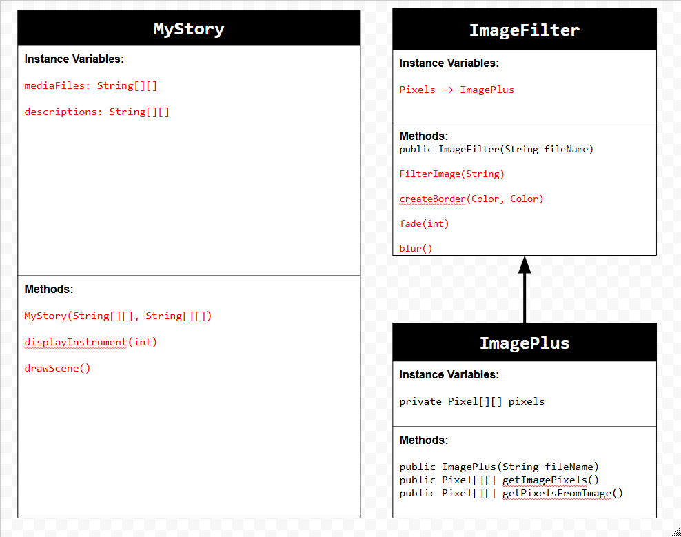
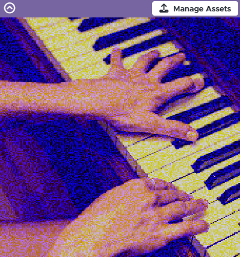

# Unit 5 - Personal Narrative

## Introduction

Images are often used to portray our personal experiences and interests. We also use image filters and effects to change or enhance the mood of an image. When combined into collages and presentations, these images tell a story about who we are and what is important to us. Your goal is to create a personal narrative using The Theater that consists of images of your personal experiences and/or interests, incorporates data related to these experiences and/or interests that can be organized in a 2D array, and uses image filters and effects to change or enhance the mood of your images.

## Requirements

Use your knowledge of object-oriented programming, two-dimensional (2D) arrays, and algorithms to create your personal narrative collage or animation:

- **Create at least two 2D arrays** – Create at least two 2D arrays to store the data that will make up your visualization.
- **Implement one or more algorithms** – Implement one or more algorithms that use loops and two-way or multi-selection statements with compound Boolean expressions to analyze the data.
- **Use Image Filters** - Include multiple image filters learned from this unit, and additionally create new ones of your own.
- **Use methods in the String class** – Use one or more methods in the String class in your program, such as to determine whether the name of an image file contains specific characters.
- **Create a visualization** – Create an image or animation that conveys the story of the data by illustrating the patterns or relationships in the data.
- **Document your code** – Use comments to explain the purpose of the methods and code segments and note any preconditions and postconditions.

## UML Diagram

Put and image of your UML Diagram here. Upload the image of your UML Diagram to your repository, then use the Markdown syntax to insert your image here. Make sure your image file name is one work, otherwise it might not properly get display on this README.

## Video

Record a short video of your story to display here on your README. You can do this by:

- Screen record your project running on Code.org.
- Upload that recording to YouTube.
- Take a thumbnail for your image.
- Upload the thumbnail image to your repo.
- Use the following markdown

^Click on the image for short video demo. 

## Story Description

Ever since childhood, music has been my passion, leading me to explore various instruments. This animation showcases my musical journey through the piano, drums, violin, and guitar. Each instrument is presented with an image, its own sound, and information about how long I practiced for. The visual effects applied to the images showcase my  "passion" with each instrument. Two 2D arrays that showcase this are **mediaFiles** that contains filenames for images and sounds, while **descriptions** holds practice durations and instrument names. Together, these arrays create a multi explanatory story of my musical exploration, allowing the audience to see, hear, and understand my experiences with each instrument.

## Image Filter Analysis

In my animation, I used three main filters: fade, blur, and border. The fade filter changes the brightness of the image by adjusting the red, green, and blue values of each pixel. It adds a set amount to each color, making the image lighter or darker. I tried to make a "blur" filter which acts as a way to "blur" by the color, blue. It works by setting a random blue value for each pixel, creating a unique, somewhat chaotic look. The border filter adds colorful edges to the image by changing the color of pixels near the edges. It sets pixels in the top and bottom rows to one color, and pixels in the left and right columns to another color, creating a "frame effect" around the image. These filters work together to make the instrument images more interesting and dynamic in the animation.

